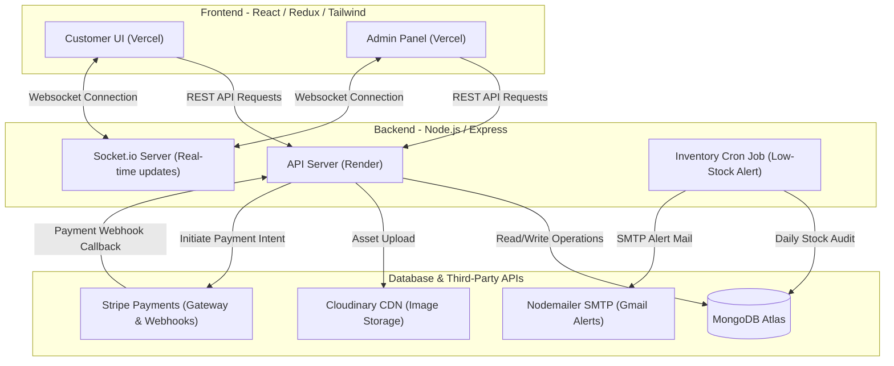

# Geeta University MerchStore

Welcome to the **Geeta University MerchStore** – a full-stack MERN web application developed for Geeta University students, faculty, and administrators to browse, purchase, and manage campus merchandise.

---

## 🏗️ Architecture Diagram



---

## 🛠️ Tech Stack & Key Features

### Frontend (Client)
- **Vite & React 19**: Ultra-fast build tool and modern components.
- **Redux Toolkit**: Centralized global state management (`auth`, `cart`, `orders`, `products`, `admin` slices).
- **Tailwind CSS**: Modern utility-first CSS styling with customized brand assets.
- **Socket.io-client**: Real-time WebSocket connection to display instant order status updates.
- **Lucide Icons & Framer Motion**: Interactive vectors and micro-animations for high-fidelity aesthetics.

### Backend (Server)
- **Node.js & Express**: Scalable API scaffolding.
- **Mongoose & MongoDB**: Object modeling and document database.
- **Passport.js & JWT**: Secure email/password login and Google OAuth 2.0 social auth with RBAC (Role-Based Access Control) guards.
- **Stripe SDK**: Payment Intents with webhook verification and idempotency keys.
- **Node-Cron & Nodemailer**: Automatic inventory low-stock checks and email alert dispatches.

---

## 📁 Repository Folder Structure

```
Merchstore/
├── client/                     # Frontend Application
│   ├── src/
│   │   ├── app/                # Redux Store Config
│   │   ├── components/         # Reusable Global Components
│   │   ├── features/           # Redux Slices (auth, cart, products, orders, admin)
│   │   ├── hooks/              # Custom Hooks (useAuth, useSocket)
│   │   ├── pages/              # Routing Views (Home, Catalog, Checkout, Admin, Dashboard)
│   │   ├── routes/             # Route Guards (ProtectedRoute, AdminRoutes)
│   │   └── utils/              # Axios Instance Config & Helper Files
│   ├── index.html
│   ├── tailwind.config.js
│   └── vite.config.js
├── server/                     # Backend API Application
│   ├── config/                 # Configurations (db, cloudinary, passport)
│   ├── controllers/            # Controller Handlers (auth, orders, products, etc.)
│   ├── cron/                   # Low-stock Background Cron Scheduler
│   ├── middleware/             # Route Guards & Error Handlers
│   ├── models/                 # Database Schemas (User, Product, Order, etc.)
│   ├── routes/                 # API Routes Mapping
│   ├── services/               # Stripe, Email, and Inventory Services
│   ├── socket/                 # Socket.io Rooms Configuration
│   ├── tests/                  # Jest Unit & Integration Test Suites
│   ├── utils/                  # Helper Utilities (generateToken, cloudinaryUpload)
│   ├── validators/             # Zod Validation Schemas
│   ├── seed.js                 # Local Database Seeder Script
│   └── server.js               # Express Server Entry Point
└── postman/                    # Postman Collection JSON Files
```

---

## 🚀 Local Installation & Configuration

### Prerequisites
- [Node.js](https://nodejs.org/en) (v18+ recommended)
- [MongoDB Community Server](https://www.mongodb.com/try/download/community) (for local testing, or a MongoDB Atlas URI)

### Step 1: Clone the Repository
```bash
git clone https://github.com/tanmaysingla84-collab/Merchstore.git
cd Merchstore
```

### Step 2: Configure Environment Variables
Create a `.env` file in the `server/` directory:
```env
PORT=5000
NODE_ENV=development
MONGO_URI=mongodb://127.0.0.1:27017/merchstore
JWT_SECRET=super_secret_for_local_testing_merchstore
JWT_EXPIRES_IN=7d
GOOGLE_CLIENT_ID=dummy_google_id
GOOGLE_CLIENT_SECRET=dummy_google_secret
GOOGLE_CALLBACK_URL=http://localhost:5000/api/auth/google/callback
CLOUDINARY_CLOUD_NAME=dummy_cloud
CLOUDINARY_API_KEY=dummy_key
CLOUDINARY_API_SECRET=dummy_secret
STRIPE_SECRET_KEY=sk_test_dummy
STRIPE_WEBHOOK_SECRET=whsec_dummy
SMTP_HOST=smtp.gmail.com
SMTP_PORT=587
SMTP_USER=merch@geetauniversity.ac.in
SMTP_PASS=dummy_pass
ALERT_EMAIL=admin@geetauniversity.ac.in
LOW_STOCK_THRESHOLD=10
CRON_SCHEDULE="0 8 * * *"
CLIENT_URL=http://localhost:5173
```

### Step 3: Run Backend Service
```bash
cd server
npm install
node seed.js     # Seeds local database with initial mock users & products
npm run dev      # Launches dev server on http://localhost:5000
```

### Step 4: Run Frontend Application
Open a new terminal window:
```bash
cd client
npm install
npm run dev      # Launches react dev server on http://localhost:5173
```

---

## 🧪 Testing

To run the automated test suite on the backend:
```bash
cd server
npm test
```
The test suite contains **68 unit/integration tests** covering all auth, order, payment, and inventory workflows.

---

## 👥 Authors & Contributions
- **Member 1**: Scaffolding, Models, Auth & Product APIs, Cloudinary.
- **Member 2**: Cart, Order Transactions, Stripe SDK, WebSockets, Email service.
- **Member 3**: Frontend Catalog, Cart, Checkout, Dashboard UI & state logic.
- **Member 4**: Admin Dashboard, Product Form Modals, Order Status toggling, Custom SVG charts, Routing & E2E Postman.
